<span class="logo"></span>
<span class="logo"></span>
<span class="logo"></span>

# Walk through

This walk-through is intended for interested parties who have not yet worked intensively with FSH.

## Dry run

* Open [https://fshschool.org/FSHOnline/#/](https://fshschool.org/FSHOnline/#/).

<a href="./assets/img/wt01-fsh-online.png">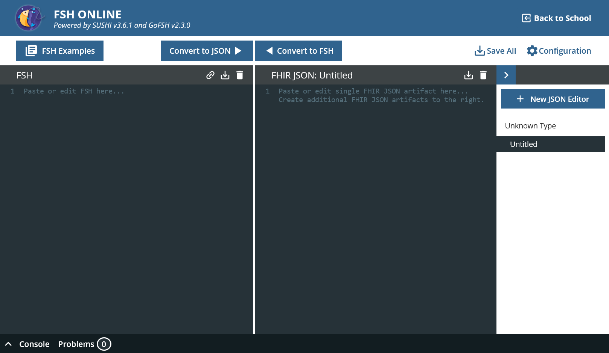</a>

On the left-hand side you can see the editor for FSH, on the right-hand side the editor for FHIR-JSON. You can edit in both and then transfer the changes to the other side using "Convert to".

FSH Online provides useful templates.

* Go to "FSH Examples" and then to "Instances >> Instance Example".

<a href="./assets/img/wt02-fsh-example.png">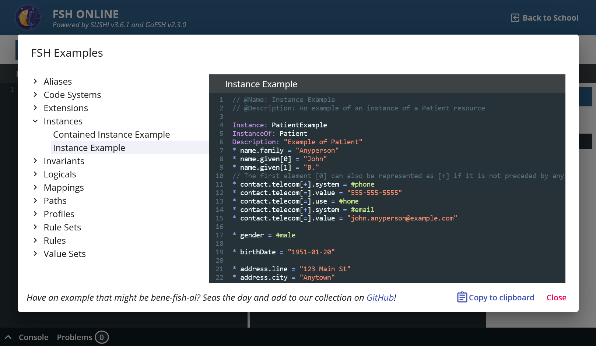</a>

* Click on "Clipboard", "Close" and paste the content in the left panel. Click "Convert to JSON".

<a href="./assets/img/wt03-fsh-patient.png">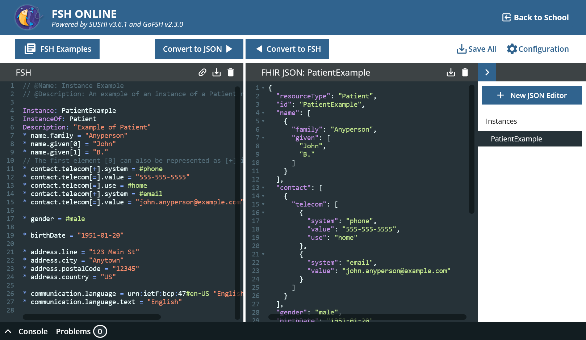</a>

That's how it works basically. A new tab has appeared on the right-hand side; several FHIR resources can be created from one FSH file.

You can now validate the example to be sure.

* Copy the content of the right panel.
* Open [https://inferno.healthit.gov/validator/](https://inferno.healthit.gov/validator/).
* Paste the content and click "Validate".

<a href="./assets/img/wt04-inferno.png">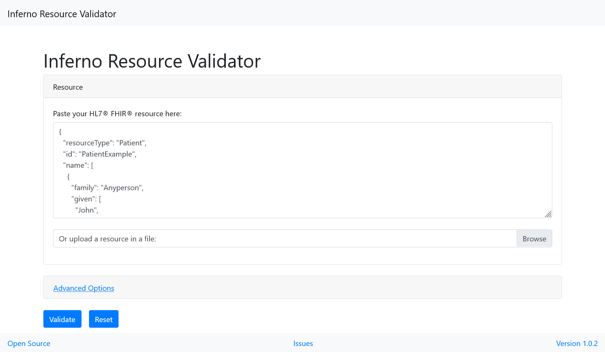</a>

There should be no errors, only some warnings.

<a href="./assets/img/wt05-inferno-valid.png">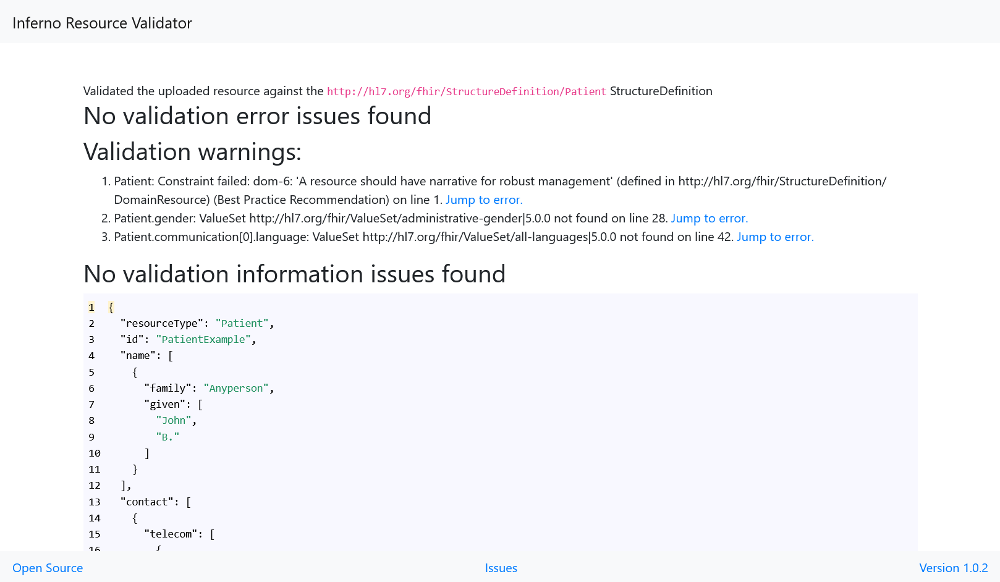</a>

## Creating an empty study

* Open [https://fshschool.org/FSHOnline/#/](https://fshschool.org/FSHOnline/#/) and delete everything possibly left in the FSH tab.
* Enter the code snippet below and substitude the name of the instance with your pref Press "Convert to JSON".

```
Instance: firetrial
InstanceOf: ResearchStudy
Description: "Example of a research study"
Usage: #example
```

<a href="./assets/img/wt06-researchstudy-template.png">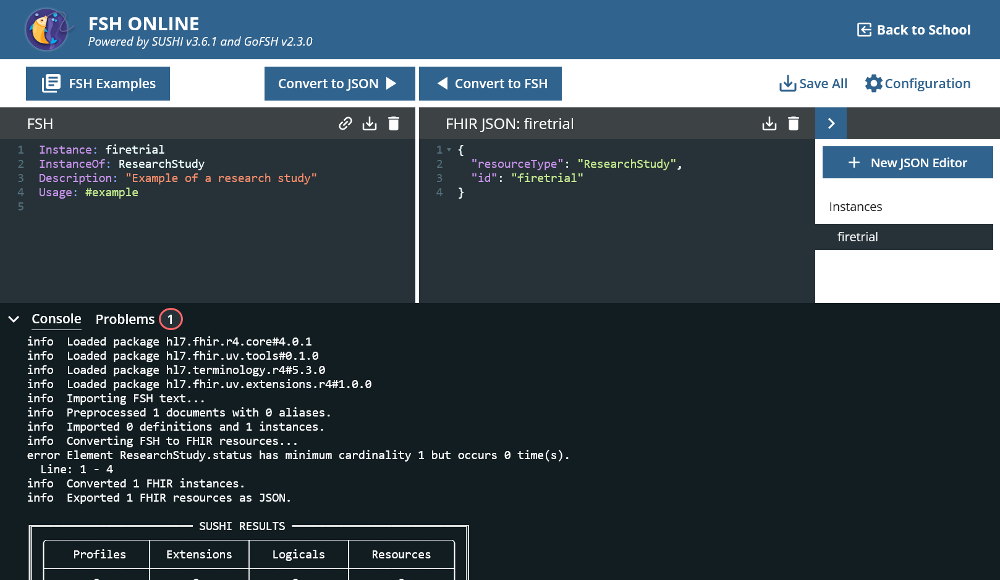</a>

It generates some JSON code, but there is obviously a mistake.

> error Element ResearchStudy.status has minimum cardinality 1 but occurs 0 time(s).
> Line: 1 - 4

The ResearchStudy has a mandatory field called status in FHIR and this is missing.

## Adding study status (code from a controlled vocabulary)

If we look at the specification of [ResearchStudy](https://hl7.org/fhir/R4/researchstudy.html#resource) in FHIR R4, we see that the cardinality of status is 1..1.

<a href="./assets/img/wt07-fhir-r4-researchstudy.png">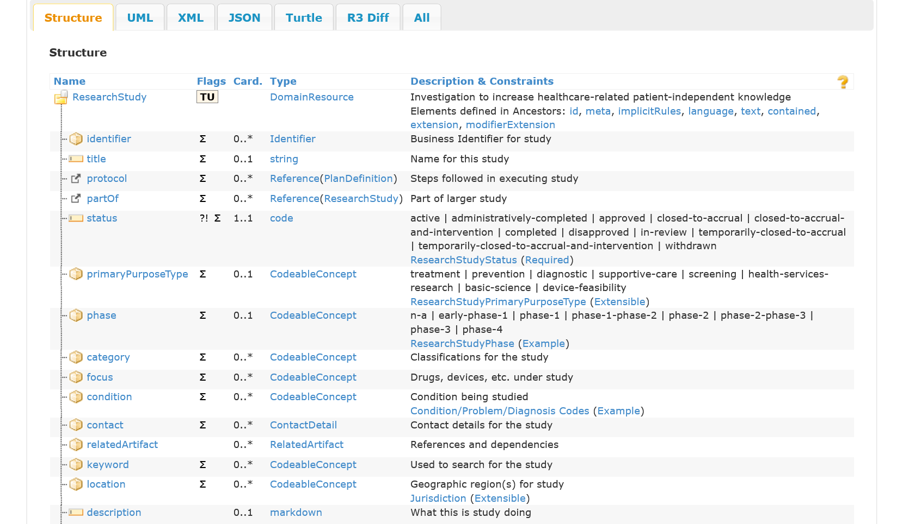</a>

We need to specify a value for status. The data type is code, i.e. it is a value from a predefined set. FHIR distinguishes between different degrees of strictness as to whether the value must actually be taken from the given values. This is the case with (Required). You can find out what the individual codes mean by clicking on ResearchStudyStatus.

```
* status = #in-review
```

All other elements are optional in the generic resource. Now no more errors are returned and the validation would also work.

<a href="./assets/img/wt08-rs-status.png">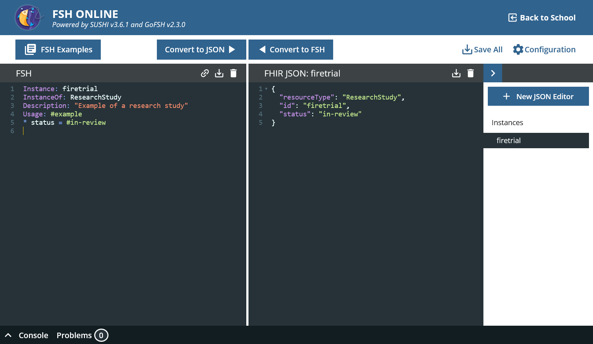</a>

## Adding the study title (string)

The title of the study is a simple string.

```
* title = "FAIRness in FHIR"
```

## Adding a description (markdown)

The description of a study is of type markdown and is assigned in the same way, except that the receiving system must be able to handle markdown syntax.

```
* description = "A study assessing the **FAIRness** of FHIR artifacts."
```

## Adding a note (Annotation)

```
* note = "Study design is still unclear."
```

Although it was about text again, it didn't work this time.

<a href="./assets/img/wt09-annotation.png">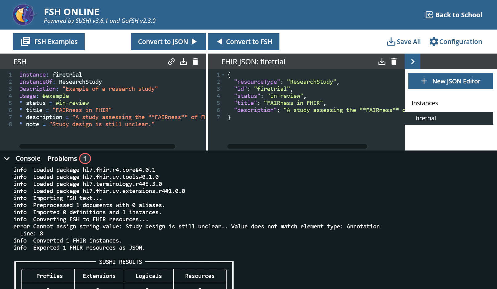</a>

The data type of note is [Annotation](https://hl7.org/fhir/R4/datatypes.html#Annotation) and this is not a primitive data type. An annotation can have an author and a creation date. We now want to dispense with this and only use the text element.

```
* note.text = "Study design is still unclear."
```

No problem while converting. 

## Adding the start and end date/time of a study (Period)

Adding dates is very similar to strings, except that a [predefined format](https://www.hl7.org/fhir/datatypes-examples.html) must be adhered to. A FHIR [Period](https://www.hl7.org/fhir/datatypes.html#Period) has an optional start and end of type datetime.

Therefore, not only dates are possible. Our example study starts today in the morning and ends in December.

```
* period.start = "2024-02-26T09:00:00+01:00"
* period.end = "2024-12"
```

<a href="./assets/img/wt10-fsh-period.png">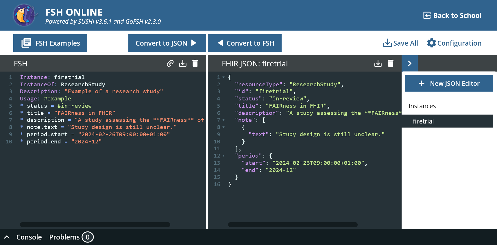</a>

## Adding the study id (Identifier)

An important criterion for findability in FAIR is a persistent identifier. Interventional clinical trials must be prospectively registered in a trial registry from which they receive an identifier. For example, we register our study in the international [ClinicalTrials.gov](https://clinicaltrials.gov/) register and receive the CT.gov number NCT05487991.

The fact that this is a universal business identifier is made clear with additional information.

```
* identifier[0].use = #official
* identifier[=].system = "https://clinicaltrials.gov"
* identifier[=].value = "NCT05487991"
```

<a href="./assets/img/wt11-fsh-identifier.png"></a>

## Adding contacts (multiple values)

Next, we would like to specify two people from the study's environment who serve as medical and organizational contacts. The element [contact](https://hl7.org/fhir/R4/researchstudy.html#resource) must be specified multiple times for this. This is very easy to do with FSH. The first instance is given an index [0]. Further instances would then receive [1] and so on. 

However, because it is often necessary to change the order later (and therefore all indices), FSH uses [=] for a further entry for the current contact and [+] for the next contact.

ResearchStudy.contact is of type [ContactDetail](https://hl7.org/fhir/R4/metadatatypes.html#ContactDetail)which itself is composed of other data types. The deeper hierarchies are separated by a dot.

```
* contact[0].name = "Dr. Franziska Jauch"
* contact[=].telecom.system = #email
* contact[=].telecom.value = "fjauch@uniklinikum-ulm.de"
* contact[=].telecom.use = #work
* contact[+].name = "Wiktor Silberk"
* contact[=].telecom.system = #phone
* contact[=].telecom.value = "+49 1715 8264023"
* contact[=].telecom.use = #mobile
```

<a href="./assets/img/wt12-fsh-contacts.png">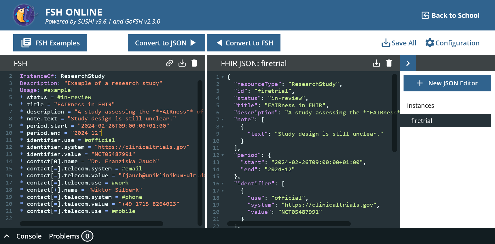</a>

## Adding the condition to be studied (Codeable Concept)

The title of a study can contain important information about what the study is about. However, medical terminology is diverse and language-dependent. For clarity and machine processability, it is better to use a community-consensus vocabulary. In the field of medicine, SNOMED CT is a good international candidate.

FHIR has three basic ways of encoding elements. We have already seen FHIR [code](https://hl7.org/fhir/R4/datatypes.html#code). Here there is only the actual code, because the set from which it can be selected is implicitly fixed. FHIR [Coding](https://hl7.org/fhir/R4/datatypes.html#Coding), on the other hand, is like a code + a system from which the code comes. A FHIR [CodeableConcept](https://hl7.org/fhir/R4/datatypes.html#CodeableConcept) can do even more: here we can even use several annotations from Code+System.

This allows the FAIR requirement for multiple relevant metadata to be met, as other systems such as ICD-10 are often used in local systems, e.g. for diagnoses in hospitals. To ensure that there is no mixture and that the study is ultimately difficult to find, we specify both values.

```
* condition.text = "Cholera"
* condition.coding[0] = $icd-10#A00.0
* condition.coding[=].version = "2024"
* condition.coding[+] = $sct#240349003
* condition.coding[=].version = "http://snomed.info/sct/900000000000207008/version/20230731"
```

What you can also see here is the version of the referenced vocabulary. As the state of knowledge about diseases changes and new ones are added (Covid-19), this is good practice.

In addition, we use the alias feature of FSH, a definition of a constant as an abbreviation for long URIs that are used several times. Aliases are placed at the beginning of the document.

```
Alias: $icd-10 = http://hl7.org/fhir/sid/icd-10
Alias: $sct = http://snomed.info/sct
```

<a href="./assets/img/wt13-fsh-codeables.png">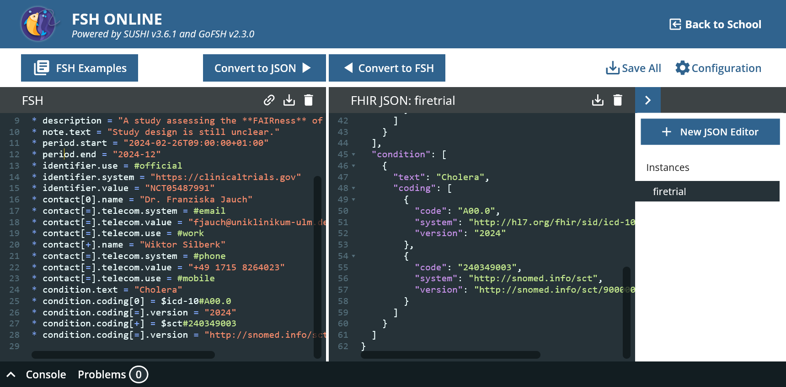</a>

## Adding sponsor and PI (Reference to another named resource)

Finally, we want to add references to other FHIR resources. FHIR ResearchStudy sponsor refers to a FHIR Organization and principalInvestigator refers to a Practitioner or a PractitionerRole. Both are independent entities like ResearchStudy itself. Both can be references by other instance as well. However, they should only be created once.

In the case of principalInvestigator, you can see another peculiarity of FHIR: for some elements, several resource types are possible as values; the data modeler selects the most suitable one.

Referencing another FHIR resource instance is easy.

```
* sponsor = Reference(firetrial-sponsor)
* principalInvestigator = Reference(firetrial-pi)
```

We can also create the target resources in the same file.

```
Instance: firetrial-sponsor
InstanceOf: Organization
Usage: #example
* name = "Ulm University Hospital"

Instance: firetrial-pi
InstanceOf: Practitioner
Usage: #example
* name.text = "Prof. Dr. T. Ester"
```

FSH Online now generates three individual files, see on the far right.

<a href="./assets/img/wt14-fsh-references.png">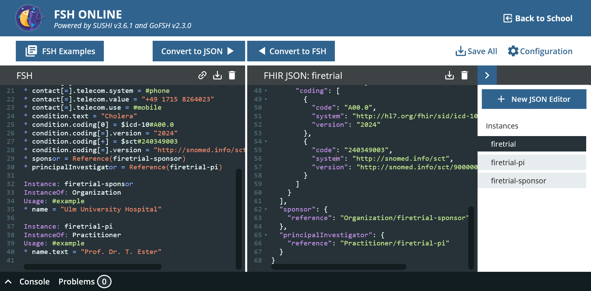</a>

## Using the FHIR4FAIR Implementation Guide ResearchStudy-uv-f4f (Profile)
```
* name.text = "Prof. Dr. T. Ester"
```

FSH Online now generates three individual files, see on the far right.

<a href="./assets/img/wt1.png"></a>

# Exercises

## Getting rid of the annoying validation warning

When we validate our current status with [Inferno](https://inferno.healthit.gov/validator/), no errors occur, but there is a strange warning:

> Warning: 

<details>
<summary>Solution</summary>

</details>
No problem while validating.


To make the last warning disappear


